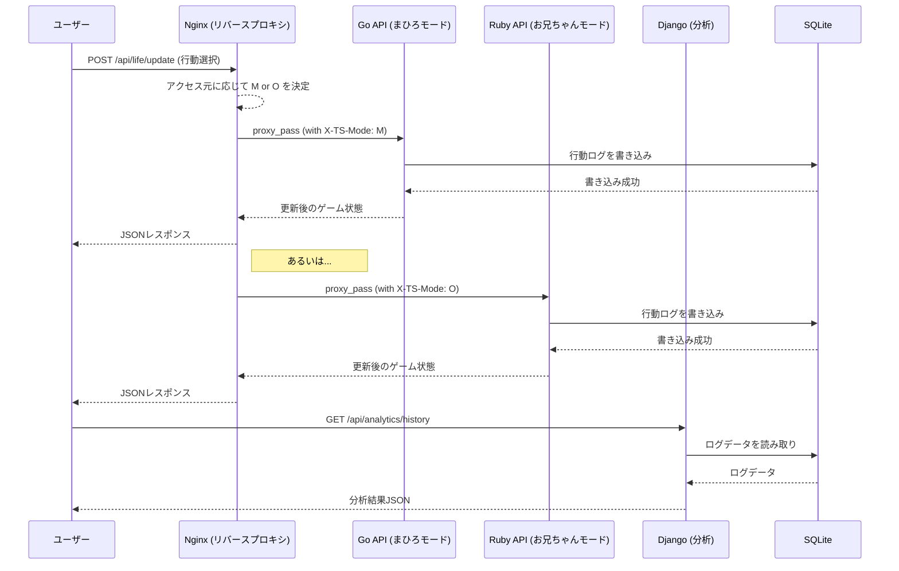

# TS Sim：まひろライフゲーム

## 🌈 概要

性別・アイデンティティが外部要因（サーバーやアクセスルート）によって左右される人生シミュレーター。  
ユーザーは「お兄ちゃん（男）」と「まひろ（女）」の間を強制的に行き来しながら、自分の「identity crisis」からの脱出を目指します。  
まじで頭悪いサイト構成しています

完全に自分のスキルアップのためのサイトです
---

## 🧩 機能仕様

### 1. ゲーム本体（フロントエンド）

- **技術**: React + Next.js

#### 構成

- **セル**：ライフゲームの1マス → 行動を表す（勉強・筋トレ・お化粧・オタ活など）
- **UI**：まひろ／お兄ちゃんのモードで色・BGM・フォントが切り替わる

#### 特徴

- 時間・行動・ルートアクセス・API応答によりモードが切り替わる
- ゲージ表示：男成分ゲージ / 女成分ゲージ / 混乱度（identity crisis）

---

### 2. サーバー構成（バックエンド＋Webサーバー）

#### 🖥️ Nginx

- **用途**：リバースプロキシ
- **ロジック**：ユーザーのアクセスごとに「ランダム or IPアドレス」などで下流のGo / Ruby にルーティング
- **特徴**：X-TS-Mode ヘッダーをランダムで付加（"M" or "O"）

#### 🖥️ Apache

- **用途**：ログ配信・ダミーエラーページ用
- **特徴**：一定確率でわざと HTTP 418（I'm a teapot）や 500（Error）を返す

#### 🐹 Go（Echo）

- **用途**：まひろモードAPI（Mモード）
- **エンドポイント例**:
    - `/api/life/update` : ゲーム状態更新（ライフゲームの次の世代生成）
    - `/api/state/mode` : 現在の性別モード返す
- **特徴**：高速に返すけど、「女の子らしい行動」が進みやすいパラメータになる

#### 💎 Ruby（RoR）

- **用途**：お兄ちゃんモードAPI（Oモード）
- **エンドポイント**：Goと共通
- **特徴**：Rails独自のルーティング構成。更新処理が微妙に遅延（現実感を演出）  
  「筋トレ」や「睡眠」など、男子力寄りの行動に影響する

#### 🐍 Django（Python）

- **用途**：分析＆人生アーカイブ
- **機能**：過去のライフゲームの結果を収集・分析し、グラフ表示（混乱度の推移など）  
  SQLiteのログDBを読み込む（読み取り専用）


#### docker
- **用途**：全サービスをコンテナで統合・管理
- **構成例**:  
    - `docker-compose.yml` で Nginx, Go, Ruby, Django, Apache, SQLite を一括起動
    - 各サービスは独立したコンテナで動作し、ネットワークを共有
    - ボリュームで SQLite データを永続化
- **特徴**：ローカル開発・検証が容易。各サーバーの再起動やスケールも柔軟
---

### 3. データベース（SQLite）

#### テーブル例

```sql
CREATE TABLE actions (
    id INTEGER PRIMARY KEY,
    user_id TEXT,
    turn INTEGER,
    mode TEXT, -- 'M' or 'O'
    action TEXT, -- 'study', 'makeup', 'workout', etc.
    identity_score INTEGER
);
```

- モードによって行動の影響度が変化
- SQLiteで軽量管理＋ログ分析用に自動エクスポート

---

## 🔁 ゲーム進行ルール

- アクセス時に、NginxでGo or Rubyにランダムルーティングされる
- 初期モード（M or O）が決まる（まひろ or お兄ちゃん）
- 1ターン＝1行動。選択した行動に応じて identity スコアが変動
- スコアが偏ると、自動でモードが反転（まひろ⇄お兄ちゃん）
- 一定ターン内に identity crisis スコアが一定値以下になるとクリア！

---

## 🖼️ 画面構成

| 画面         | 内容                                               |
| ------------ | -------------------------------------------------- |
| ホーム画面   | ロゴ・スタートボタン・（たまにHTTPエラーを演出）   |
| ゲーム画面   | ライフゲーム風マス＋行動ボタン＋ゲージ             |
| 分析画面     | identity crisisスコアの推移 / 使用APIロググラフ（Django） |

---

## 🎯 目的と学べる技術

| 技術         | 学べること                                 |
| ------------ | ------------------------------------------ |
| Go / Echo    | API設計・高速処理・Webサーバーと協調       |
| Ruby / RoR   | MVC構成・ルーティング・柔軟な記述           |
| Django       | 分析処理・ログ集計・DB操作                  |
| React / Next.js | 状態管理・コンポーネント構成・API連携    |
| SQLite       | 軽量DB設計・データの永続化と分析            |
| Nginx / Apache | サーバー構成・ルーティング制御・エラー制御 |

---

## 📝 公開時に面白くなる演出

- 定期的に「404 Not Found（まひろが脱走しました）」とか出す
- 「TS率 83%」「identity崩壊中…」などの意味深ステータス表示
- シェアボタンで「まひろとして生き延びた記録」をSNSに投稿可

---

# 「TS Sim」フロントエンド設計案 (Next.js App Router)

ts-simプロジェクトのフロントエンド開発における、推奨ファイル構造と各コンポーネントの詳細な役割を以下に示します。  
状態管理やAPI連携、そしてローカルLLM（LM Studio）との連携も考慮した設計です。

## 📂 推奨ファイル構造

```
ts-sim/
├── app/
│   ├── layout.tsx                # 全ページの共通レイアウト
│   ├── page.tsx                  # メインのゲームページ
│   ├── analytics/
│   │   └── page.tsx              # 分析ページ
│   └── api/
│       └── llm/
│           └── route.ts          # LM StudioへのプロキシAPIルート
├── components/
│   ├── game/                     # ゲーム関連コンポーネント
│   │   ├── GameGrid.tsx          # ライフゲームの盤面
│   │   ├── StatusBar.tsx         # 各種ゲージやモード表示
│   │   ├── ActionPanel.tsx       # 行動選択ボタン
│   │   └── ChatWindow.tsx        # LLMとのチャットウィンドウ
│   └── ui/                       # 共通UIパーツ (shadcn/uiなどを想定)
│       ├── button.tsx
│       ├── card.tsx
│       └── progress.tsx
├── contexts/
│   └── GameContext.tsx           # ゲーム全体の状態を管理するContext
├── hooks/
│   └── useGameLogic.ts           # ゲームの主要ロジックをまとめたカスタムフック
└── lib/
    └── api.ts                    # バックエンドAPIとの通信処理
```

---

## 🧩 主要コンポーネントの詳細

### 1. `app/page.tsx` (メインゲームページ)

- **役割**: ゲーム画面の心臓部。各種コンポーネントを統合し、GameContextで全体の状態を管理。
- **実装内容**:
    - GameProviderでページ全体をラップし、状態管理の基盤を提供
    - StatusBar, GameGrid, ActionPanel, ChatWindowをレイアウトに従って配置
    - ゲームモード（まひろ/お兄ちゃん）に応じて、ページの背景色やBGMを変更するロジックを持つ

### 2. `components/game/GameGrid.tsx`

- **役割**: ライフゲームの盤面（グリッドとセル）を描画
- **実装内容**:
    - 2次元配列で表現されるゲームの状態を受け取り、CSS Gridや`<div>`の繰り返しで盤面を生成
    - 各セルは、行動内容や状態に応じて色やアイコンが変化
    - （オプション）framer-motionなどでセルの状態変化にアニメーションを加える

### 3. `components/game/StatusBar.tsx`

- **役割**: プレイヤーの現在の状態を可視化
- **実装内容**:
    - 現在のモード（「まひろモード」「お兄ちゃんモード」）を表示
    - 男成分ゲージ, 女成分ゲージ, 混乱度ゲージをprogress要素やカスタムUIで描画
    - GameContextから現在のスコアやモードを受け取り、UIに反映

### 4. `components/game/ActionPanel.tsx`

- **役割**: プレイヤーがターンごとに行う行動（勉強、筋トレ、お化粧など）を選択するボタン群を提供
- **実装内容**:
    - 各行動に対応するボタンを配置
    - ボタンがクリックされたら、GameContextを通じてゲームロジック（useGameLogic）を呼び出し、バックエンドAPIにリクエストを送信
    - 現在のモードによって、選択できる行動やボタンのデザインが変化

### 5. `components/game/ChatWindow.tsx` (LM Studio連携)

- **役割**: ローカルで動作するLLM（LM Studio）と対話し、ゲーム内のキャラクター（まひろ or お兄ちゃん）としての応答を生成
- **実装内容**:
    - テキスト入力フィールドと送信ボタン、会話ログ表示エリアで構成
    - ユーザーがメッセージを送信すると、Next.jsのAPIルート (`/api/llm`) にリクエストを送信
    - APIルートは、受け取ったメッセージをLM StudioのAPIエンドポイント (`http://localhost:1234/v1/chat/completions`) に転送（プロキシ）
    - LLMからの応答をストリーミングで受け取り、会話ログにリアルタイムで表示

---

## ⚙️ 状態管理とロジック

### `contexts/GameContext.tsx`

- **役割**: React Context と useReducer を組み合わせ、ゲーム全体の状態（モード、スコア、ターン数、盤面の状態など）を一元管理
- **提供するもの**:
    - `state`: 現在のゲーム状態オブジェクト
    - `dispatch`: 状態を更新するための関数。ActionPanelなどから呼び出される

### `hooks/useGameLogic.ts`

- **役割**: dispatchから呼び出される複雑な状態更新ロジックをカプセル化
- **実装内容**:
    - 行動選択時のAPIリクエスト送信
    - APIレスポンスに基づいたスコア計算と状態更新
    - モードチェンジの判定と実行

---

この設計案を基に、まずは `components/ui` の共通パーツを整備し、次に GameGrid や StatusBar といった静的な表示コンポーネントから作成していくのがおすすめです。その後、GameContext を導入して各コンポーネントを連携させていくと、スムーズに開発が進められます。

---

# 「TS Sim」バックエンド・インフラ設計案

このドキュメントは、「TS Sim：まひろライフゲーム」のバックエンドおよびインフラの全体像を定義します。  
複数のサーバーが協調（あるいは非協調）して動作し、ユーザーのアイデンティティを揺さぶるというゲームコンセプトを実現するための設計です。

---

## 🏛️ 全体アーキテクチャ概要

- ユーザーからのリクエストは、まずリバースプロキシである Nginx が全て受け取る
- Nginxは、その時の気まぐれ（設定に基づくロジック）で、リクエストを Go (Echo) または Ruby (Rails) のAPIサーバーに振り分け
- この時、X-TS-Modeヘッダーを付与し、そのターンのモードを強制的に決定
- 各APIサーバーは、受け取ったリクエストとモードに基づいてゲームの状態を更新し、その結果を SQLite データベースに記録
- 分析ページからのリクエストは、Django サーバーが直接処理し、SQLiteから読み取ったデータを集計・分析して返す
- Apache は意図的にエラーを返すためだけに存在し、Nginxから時々リクエストが流される

---

### 🌊 データフロー (Mermaid記法)



---

## ⚙️ コンポーネント別詳細設計

### 1. 🖥️ Nginx (リバースプロキシ)

- **役割**: 全リクエストの受付、負荷分散、モード決定、静的コンテンツ配信、エラーハンドリング

#### 設定例（nginx.conf の抜粋）

```nginx
# upstreamでGoとRubyのサーバーを定義
upstream api_servers {
    server go_server:8080;
    server ruby_server:3000;
}

server {
    listen 80;

    # /api/ へのリクエストを処理
    location /api/ {
        # IPアドレスの末尾で簡易的に振り分け先を決定
        set $backend_server http://go_server:8080;
        if ($remote_addr ~* \.[0-4]$) {
            set $backend_server http://ruby_server:3000;
        }

        # モードを決定するヘッダーを付与
        proxy_set_header X-TS-Mode "M"; # デフォルトはまひろ
        if ($backend_server ~* "ruby") {
            proxy_set_header X-TS-Mode "O"; # Rubyならお兄ちゃん
        }

        proxy_pass $backend_server;
        proxy_set_header Host $host;
        proxy_set_header X-Real-IP $remote_addr;
        proxy_set_header X-Forwarded-For $proxy_add_x_forwarded_for;
    }

    # 意図的なエラーページへのルーティング
    error_page 500 502 503 504 /custom_50x.html;
    location = /custom_50x.html {
        # Apacheにエラー処理を丸投げ
        proxy_pass http://apache_server:80;
    }
}
```

---

### 2. 🐹 Go (Echo) - まひろモードAPI

- **役割**: 高速なレスポンスを返す「まひろモード」のAPI。女の子らしい行動のスコアにボーナスを与える

#### ファイル構造例

```
go-server/
├── main.go
├── handler/
│   └── life_handler.go
└── db/
    └── sqlite.go
```

#### エンドポイント `/api/life/update`

- **Method**: POST
- **Request Body**: `{ "userId": "...", "action": "makeup" }`
- **Logic**: X-TS-ModeヘッダーがMであることを確認。actionに応じてスコアを計算（makeupなら女成分+10, 混乱度-5など）。結果をSQLiteに保存し、更新後の全ゲージ情報を返す
- **Response Body**: `{ "mode": "M", "gauges": { "male": 10, "female": 50, "crisis": 20 } }`

---

### 3. 💎 Ruby (Ruby on Rails) - お兄ちゃんモードAPI

- **役割**: 少し遅延のある「お兄ちゃんモード」のAPI。男の子らしい行動にボーナスを与える

#### ファイル構造

- `app/controllers/api/life_controller.rb`
- `config/routes.rb`

#### エンドポイント `/api/life/update`

- **Method**: POST
- **Logic**: X-TS-ModeヘッダーがOであることを確認。Goと同様にスコア計算（workoutなら男成分+10）。sleep(rand(0.5..1.5)) を入れて意図的にレスポンスを遅らせ、現実感を演出
- **Response Body**: Goと共通のフォーマット

---

### 4. 🐍 Django (Python) - 分析＆人生アーカイブ

- **役割**: 読み取り専用の分析APIを提供

#### ファイル構造

- `analytics/views.py`
- `analytics/serializers.py`

#### エンドポイント `/api/analytics/identity_history`

- **Method**: GET
- **Query Param**: `?userId=...`
- **Logic**: SQLiteのDBファイルを読み取り専用で接続。指定されたuserIdのactionsテーブルからturnごとのidentity_scoreを取得し、時系列データとして返す
- **Response Body**: `{ "history": [ { "turn": 1, "score": 5 }, { "turn": 2, "score": 8 }, ... ] }`

---

### 5. 🗃️ SQLite (データベース)

- **役割**: 全ての行動ログを軽量に記録

#### スキーマ (actionsテーブル)

```sql
CREATE TABLE actions (
    id INTEGER PRIMARY KEY AUTOINCREMENT,
    user_id TEXT NOT NULL,
    turn INTEGER NOT NULL,
    mode TEXT NOT NULL, -- 'M' or 'O'
    processed_by TEXT NOT NULL, -- 'go' or 'ruby'
    action TEXT NOT NULL,
    male_score_change INTEGER,
    female_score_change INTEGER,
    crisis_score_change INTEGER,
    created_at TIMESTAMP DEFAULT CURRENT_TIMESTAMP
);
```

- processed_byカラムを追加し、どちらのAPIが処理したかを記録すると分析がより面白くなります

---

この設計により、各技術スタックの特性を活かしつつ、プロジェクトのユニークな世界観を技術的に表現することが可能になります。